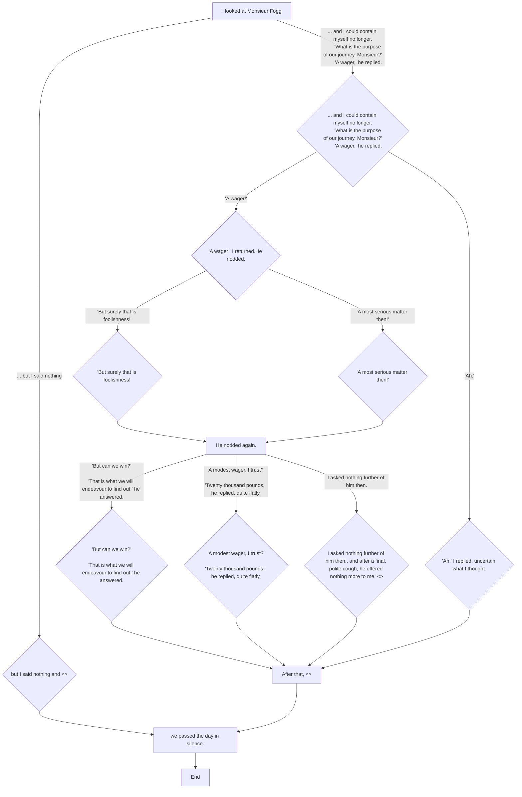

If we take this code
```
- I looked at Monsieur Fogg
*	... and I could contain myself no longer.
	'What is the purpose of our journey, Monsieur?'
	'A wager,' he replied.
	* * 	'A wager!'[] I returned.
			He nodded.
			* * * 	'But surely that is foolishness!'
			* * *  'A most serious matter then!'
			- - - 	He nodded again.
			* * *	'But can we win?'
					'That is what we will endeavour to find out,' he answered.
			* * *	'A modest wager, I trust?'
					'Twenty thousand pounds,' he replied, quite flatly.
			* * * 	I asked nothing further of him then[.], and after a final, polite cough, he offered nothing more to me. <>
	* * 	'Ah[.'],' I replied, uncertain what I thought.
	- - 	After that, <>
*	... but I said nothing[] and <>
- we passed the day in silence.
- -> END

```

then the decomposition should be

