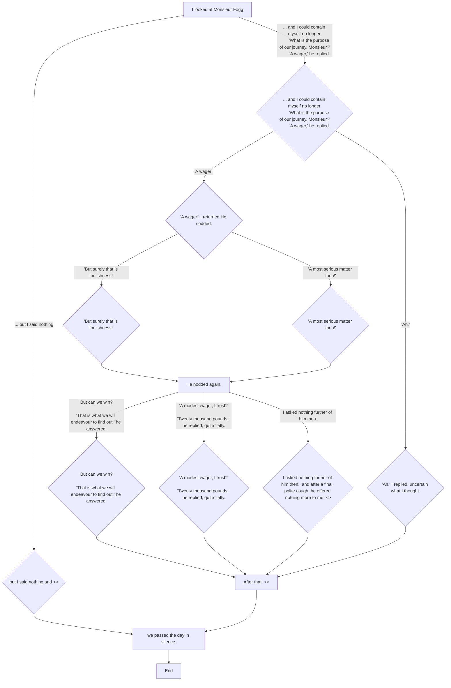
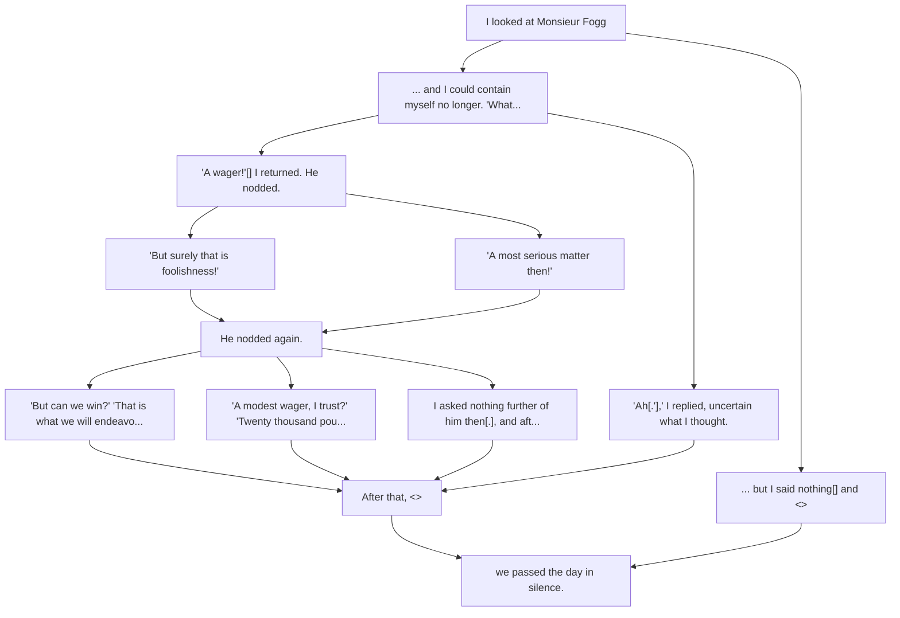

If we take this code
```
- I looked at Monsieur Fogg
*	... and I could contain myself no longer.
	'What is the purpose of our journey, Monsieur?'
	'A wager,' he replied.
	* * 	'A wager!'[] I returned.
			He nodded.
			* * * 	'But surely that is foolishness!'
			* * *  'A most serious matter then!'
			- - - 	He nodded again.
			* * *	'But can we win?'
					'That is what we will endeavour to find out,' he answered.
			* * *	'A modest wager, I trust?'
					'Twenty thousand pounds,' he replied, quite flatly.
			* * * 	I asked nothing further of him then[.], and after a final, polite cough, he offered nothing more to me. <>
	* * 	'Ah[.'],' I replied, uncertain what I thought.
	- - 	After that, <>
*	... but I said nothing[] and <>
- we passed the day in silence.
- -> END

```

then the decomposition should be




In fact it can be read line by line

1. - I looked at Monsieur Fogg => first container, which children?
2. *	... and I could contain myself no longer. => Level 1 choice => this is a children of the previous container
3. 	'What is the purpose of our journey, Monsieur?' => base content => this is a children of the line 2 container
4. 	'A wager,' he replied. => base content => this is a children of the line 3 container
5. * * 	'A wager!'[] I returned. level 2 choice => children of the line 4 container
6. He nodded. children of the line 5 container
7. * * * 	'But surely that is foolishness!' level 3 choice => children of the line 6 container
8. * * *  'A most serious matter then!', level 3 again! so children of the line 6 container
9. - - - 	He nodded again. level 3 gather => children of all the same level previous choice
10. 


It leads to the following algorithm
Line have a level and a type (CHOICE, GATHER, BASE_CONTENT)

1. Initial line is a container
2. If line.type ==  BASE CONTENT => merge with the previous container
3. If line == CHOICE => grab the level of this choice and till we meet a higher level choice or a gather all the choice with same level are going to be the children of the last container we see before this choice
4. If line is GATHER => if same level than current level => 


def parse => list[Container]

Container(content=line1,  children=parse(line2))

parse:
children = []
children = parse(suite, niveau1)


niveau 0, 
parse(text, 0) = 
    
